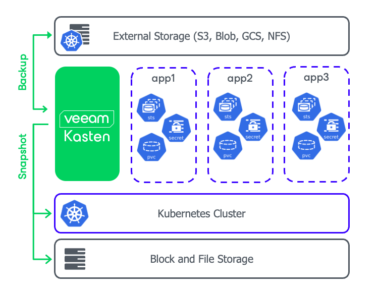
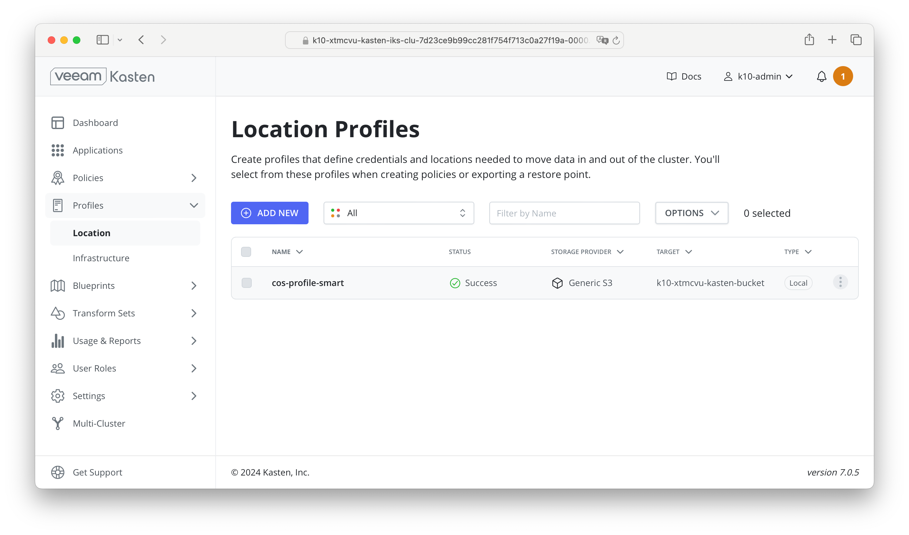

# Kasten K10 installation on IKS

Kasten K10 is a Kubernetes-native backup and disaster recovery solution designed to protect, move, and manage containerized applications. On IBM Cloud, Kasten K10 provides robust capabilities to ensure the safety and recoverability of your Kubernetes workloads.

IKS (IBM Cloud Kubernetes Service) is a managed Kubernetes service to create your own cluster of compute hosts where you can deploy and manage containerized apps on IBM Cloud.



The aim of this blog is to guide you through a full deployment of Kasten K10 on a cluster IKS.

> Estimated duration: 90 mins including the infrastructure provisioning

## Pre-Requisites

This blog requires the following command lines:

* [IBM Cloud CLI](https://github.com/IBM-Cloud/ibm-cloud-cli-release/releases)
* [Terraform CLI](https://developer.hashicorp.com/terraform/downloads)
* [git](https://git-scm.com/book/en/v2/Getting-Started-Installing-Git)
* [jq CLI JSON processor](https://jqlang.github.io/jq/download/)
* [Helm package manager](https://helm.sh/)

> This blog has been tested with the version IKS v1.29 and Kasten K10 v7.0.5.

## Provision a cluster IKS via Terraform

These Terraform scripts will provision the following Cloud Services:

* 1 Resource Group
* 1 VPC
* 3 Subnets spread out across 3 Zones
* IKS cluster version 1.29 with 2 nodes of each 4x16 (https://cloud.ibm.com/kubernetes/catalog/create)
* 1 Key Protect service to encrypt resources.

Follow those steps:

1. Clone this repository

    ```sh
    git clone https://github.com/lionelmace/kasten-on-iks
    ```

1. Login to IBM Cloud

    ```sh
    ibmcloud login
    ```

1. Create and store the value of an API KEY as environment variable

    ```sh
    export IBMCLOUD_API_KEY=$(ibmcloud iam api-key-create my-api-key --output json | jq -r .apikey)
    ```

    > If the variable "ibmcloud_api_key" is set in your provider,
    > you can initialize it using the following command
    > export TF_VAR_ibmcloud_api_key="Your IBM Cloud API Key"

1. Go to the Terraform directory

    ```sh
    cd terraform
    ```

1. Terraform must initialize the provider before it can be used.

    ```sh
    terraform init
    ```

1. Review the plan

    ```sh
    terraform plan -var-file=testing.auto.tfvars
    ```

1. Start provisioning.

   > Estimated duration: 30 mins

    ```sh
    terraform apply -var-file=testing.auto.tfvars
    ```

## Connect to a cluster IKS

1. Replace the cluster-name (including <>) with the the cluster name.

    ```sh
    export IKS_CLUSTER_NAME=<cluster-name>
    ```

1. Log in to the IKS cluster using the following command:

    ```sh
    ibmcloud ks cluster config -c $IKS_CLUSTER_NAME --admin
    ```

1. Set the values of both the ingress subdomain and the ingress secret of your cluster. Those values will be used in the deployment yaml later.

    ```sh
    export IKS_INGRESS_URL=$(ibmcloud ks cluster get -c $IKS_CLUSTER_NAME | grep "Ingress Subdomain" | awk '{print tolower($3)}')
    export IKS_INGRESS_SECRET=$(ibmcloud ks cluster get -c $IKS_CLUSTER_NAME | grep "Ingress Secret" | awk '{print tolower($3)}')
    ```

1. Verify the values you set

    ```sh
    echo $IKS_INGRESS_URL
    echo $IKS_INGRESS_SECRET
    ```

## Install Kasten K10 on IKS

### Install K10 Dashboard

1. Add the Kasten Helm charts repository using the following command:

    ```sh
    helm repo add kasten https://charts.kasten.io/
    ```

1. Run a repo update to get the latest Kasten version.

    ```sh
    helm repo update
    ```

    > Note: you can see the version by running the command: `helm repo list --versions`

1. Create the namespace where Kasten will be installed. By default, the installation creates the namespace **kasten-io**.

    ```sh
    kubectl create namespace kasten-io
    ```

1. Install Kasten K10 in IKS using the following Helm command:

    ```sh
    helm install k10 kasten/k10 --namespace=kasten-io
    ```

    > Use this command to install on OpenShift `helm install k10 kasten/k10 --namespace=kasten-io --set scc.create=true`

1. Check that installation is complete and all pods are up and running in the kasten-io namespace:

    ```sh
    kubectl get pods -n kasten-io
    ```

    > Note: It takes 3 mins to get all the pods up and running.

1. Check the status of PVC

    ```sh
    kubectl get pvc -n kasten-io
    ```

1. Create a route for accessing the Kasten dashboard:

    ```sh
    kubectl apply -f - <<EOF   
    ---
    apiVersion: networking.k8s.io/v1
    kind: Ingress
    metadata:
      name: k10-ingress
      namespace: kasten-io
    spec:
      ingressClassName: public-iks-k8s-nginx
      rules:
      - host: $IKS_INGRESS_URL
        http:
          paths:
          - path: "/"
            pathType: Prefix
            backend:
              service:
                name: gateway
                port:
                  number: 8000
    EOF
    ```

1. Open the K10 dashboard in a browser

    ```sh
    open https://$IKS_INGRESS_URL/k10/
    ```

1. Accept the Terms

   

### Configure Storage Class for Snapshot Volume

The default storage class **ibmc-vpc-block-10iops-tier** needs to be validated. To do so, the Kasten annotation must be added to the VolumeSnapshotClass first.
  
1. Annotate the Volume Snapshot class

    ```sh
    kubectl apply -f - << EOF
    ---
    kind: VolumeSnapshotClass
    apiVersion: snapshot.storage.k8s.io/v1
    metadata:
      name: ibmc-vpcblock-odf-10iops-snapclass
      annotations:
        snapshot.storage.kubernetes.io/is-default-class: "true"
        k10.kasten.io/is-snapshot-class: "true"
    driver: vpc.block.csi.ibm.io
    deletionPolicy: Delete
    EOF
    ```

1. In K10 console, go to the **Settings > System Information**. Scroll down to Storage Classes.

1. Click on Validate button on the right hand side in the storage class **ibmc-vpc-block-10iops-tier**

1. After the few seconds, the status should become **Valid**.

    

### Create Location profile for IBM COS Smart bucket

Location profiles are used to create backups from snapshots, move applications and their data across clusters and potentially across different clouds, and to subsequently import these backups or exports into another cluster.

Exporting or importing data requires an object storage location. We will use the IBM COS Bucket created via Terraform. IBM COS is an S3-compatible object storage system hosted on IBM Cloud.

1. The COS credentials have been automatically generated by Terraform. You should see the following when your terraform apply completes.

    

1. Let's set those IBM COS values into variables to reuse them later.

    ```sh
    ibm_cos_access_key_id= <copy the ID value from the terraform>
    ibm_cos_bucket_name= <copy the bucket name value from the terraform>
    ibm_cos_endpoint= <copy the endpoint value from the terraform>
    ibm_cos_access_key_secret= <copy the secret value from the terraform>
    ```

1. Create a Kubernetes secret to store the COS credentials for K10

    ```sh
    kubectl create secret generic k10-cos-secret \
      --namespace kasten-io \
      --type secrets.kanister.io/aws \
      --from-literal=aws_access_key_id=$ibm_cos_access_key_id \
      --from-literal=aws_secret_access_key=$ibm_cos_access_key_secret
    ```

1. Create Location profile for IBM COS Smart bucket

    ```sh
    echo | kubectl apply -f - << EOF
    ---
    apiVersion: config.kio.kasten.io/v1alpha1
    kind: Profile
    metadata:
      name: cos-profile-smart
      namespace: kasten-io
    spec:
      type: Location
      locationSpec:
        credential:
          secretType: AwsAccessKey
          secret:
            apiVersion: v1
            kind: Secret
            name: k10-cos-secret
            namespace: kasten-io
        type: ObjectStore
        objectStore:
          endpoint: https://$ibm_cos_endpoint
          name: $ibm_cos_bucket_name
          objectStoreType: S3
          skipSSLVerify: true
    EOF
    ```

    > Disabling SSL verification is only recommended for test setups.

1. You should now see the Location Profile in K10 Dashboard

    

## Resources

* Kasten K10 [Overview](https://docs.kasten.io/latest/index.html)
* Kasten [Release Notes](https://docs.kasten.io/latest/releasenotes.html)
* Kasten [Supported Kubernetes Version](https://docs.kasten.io/latest/operating/support.html)
